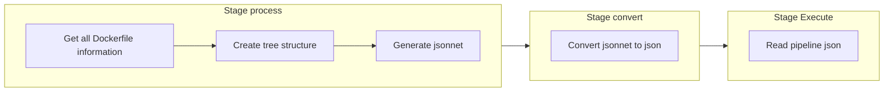
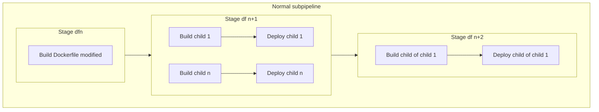
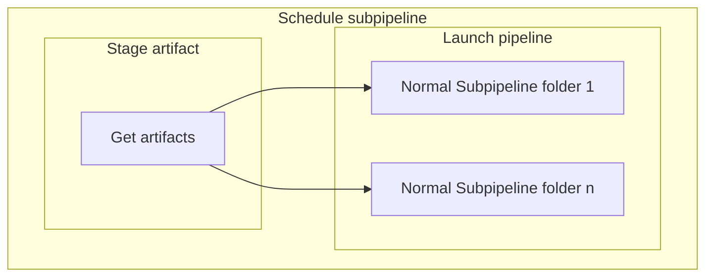

# GitLab CI Pipeline Présentation

Ce projet utilise une **pipeline GitLab CI/CD modulaire**, organisée autour d'un fichier parent `.gitlab-ci.yml` qui inclut plusieurs blocs YAML spécifiques à chaque fonctionnalité.

---

## Structure générale

```
.gitlab-ci.yml           # Fichier parent principal
ci/
├── init.yml             # Bloc pour l'initialisation de cicd-yaml
├── build-docker.yml     # Bloc pour la construction des images Docker
├── trigger-project.yml  # Bloc pour le trigger inter-projets
├── setup-project.yml    # Bloc pour la configuration des projets
├── clean-log.yml        # Bloc pour le nettoyage des logs gitlab
├── clean-registry.yml   # Bloc pour le nettoyage des images Docker
```

### Fichier parent `.gitlab-ci.yml`

Le fichier parent est responsable de :

* Inclure les blocs YAML spécifiques pour chaque feature via `include`
* Definir le workflow général de la pipeline (changement de variables en fonction du type de lancement, création d'argument générique qu'on peut mettre en message de commit etc..)
* Définir un tag par défaut pour les runners gitlab.
* Définir les **stages** globaux de la pipeline (`prepare`, `process`, `deploy`, etc.)
* Définir le stage en commun entre toutes les features, la récupération du projet de script cicd-script :

```yaml
include:
  [...]
  - local: "features/build-docker.yml"
    rules:
      - exists:
          - features/build-docker.yml
  [...]

workflow:
  name: "$PIPELINE_DISPLAY_NAME"
  rules:
    # --------------------- 
    # --- NAME PIPELINE ---
    # ---------------------
    - if: $CI_PIPELINE_SOURCE =~ /^(schedule|web)/
      variables:
        PIPELINE_DISPLAY_NAME: "[$CI_PIPELINE_SOURCE] $CI_COMMIT_MESSAGE"
    [...]

default:
  tags:
    - $RUNNER_TAGS

stages:
  - prepare
  - process
  - deploy
  [...]

get-files-from-git:
  stage: prepare
  [...]
```

### Blocs YAML modulaires

Chaque fichier inclus contient uniquement la configuration nécessaire à une fonctionnalité particulière :

* **init.yml** : Initialisation des images python-process et jsonnet-folder pour pouvoir lancer les différentes features.
* **build-docker.yml** : Construction des images Docker, push vers le registry et deploiement dans l'infra.
* **trigger-project.yml** : Trigger d'un projet vers un autre projet Gitlab ou tout autre webhooks (ex: Jenkins).
* **setup-project.yml** : Configuration des projets pour permettre les différentes features (Build et Trigger).
* **clean-log.yml** : Nettoyage périodique des logs pour éviter la saturation de Gitlab.
* **clean-registry.yml** : Nettoyage périodique des images en fonction de leurs statuts (Image plus build ou image d'une branche dev supprimé) pour éviter la saturation de Gitlab.

### Arguments spécifiques

Si le message du commit (et donc la variable `$CI_COMMIT_MESSAGE`) contient l'un (ou plusieurs) des arguments listés ci-dessous, le comportement de la pipeline associée est modifié.

| Objectif          | Argument                  | Comportement associé |
|-------------------|---------------------------|----------------------|
| Reconstruction    | `ci-all`                  | Reconstruction de toutes les images, que les fichiers associés à ces images aient été modifiés ou non                                                                                 |
| Reconstruction    | `ci-check-before-push`    | Push de l'image vers la registry seulement si des différences entre l'image construite par la pipeline et l'image déjà stockée sur la registry sont constatées                        |
| Reconstruction    | `ci-branch-dev`    | Lance la reconstruction sur la pipeline de développement |
| Nettoyage         | `ci-clean-dev`            | Lancement du module clean-registry mode suppression image dev|
| Nettoyage         | `ci-clean-nobuild`        | Lancement du module clean-registry mode suppression image no build|
| Nettoyage         | `ci-clean-log`        | Lancement du module clean-log |

#### Exemples
- `ci-all && ci-check-before-push` pour forcer la reconstruction de toutes les images, sans les push si c'est inutile
- `ci-clean-nobuild && ci-clean-dev` pour nettoyer les anciennes versions, et les version de dev obselète.

### Build-docker module

#### Lancement

Le module se déclenche à chaque push/merge d'un utilisateur sauf pour la création d'une nouvelle branche dans un projet configuré au préalable par le module de setup (ENABLE_BUILD = 'yes').

#### Etapes

La pipeline principale est séparé en 3 étapes : `process`, `convert`, `execute`. 

La première étape `process` suit l'étape `prepare` et lance le script python correspondant qui va récuperer les informations de toutes les images docker présente dans le repo où la pipeline est lancée grâce à l'architecture général. Chaque image docker aura son parent associé (via le dernier FROM du Dockerfile) permettant de faire le lien entre chacun. Ces derniers seront séparés par couches (df0, df1 ...) où plus on est dans une couche supérieur (df1 > df0 ) et plus on a de parents. Enfin, le script crée un nouveau .jsonnet qui va permettre d'automatiquement crée un nouveau .yaml avec toutes les informations nécessaire. Si ci-all est dans le message du commit, la conversion se fera en plusieurs jsonnet pour éviter d'avoir trop de build pour une seule sous-pipeline.

La deuxième étape `convert` suit l'étape `process` convertit le .jsonnet en .yaml et le stock.

La troisième étape `execute` suit l'étape `convert` et lance le nouveau .yaml en tant que pipeline enfant. Ce pipeline est une succession de build des couches df0 à dfn avec n le nombre de couche au total. Dans le cas où toutes les images sont builds (schedule), chacune des images devra attendre que le build de son parent reussisse avant de se lancer et, dans le cas contraire, le build ne se passera pas. Dans le cas où seul l'image modifié doit être build, les builds d'elle et ses enfants seront lancés (Si l'image parent non build n'existe pas dans le registry, l'image preprod sera récupéré à la place). L'image est ensuite push dans la registry et un job peut suivre celui du build qui déclenche le déploiement.

#### Schémas explicatif

##### Pipeline principale



##### Sous pipelines





---

## Avantages de cette approche

* **Lisibilité** : Chaque bloc est autonome et facile à comprendre.
* **Réutilisabilité** : Les blocs peuvent être inclus dans d’autres pipelines.
* **Maintenance simplifiée** : Modification d’une feature sans toucher au reste de la pipeline.
* **Scalabilité** : Ajout facile de nouvelles fonctionnalités CI/CD en créant simplement un nouveau bloc YAML.

---

## Bonnes pratiques

* Nommer les fichiers YAML de manière claire (`build-*.yml`, `clean-*.yml`).
* Garder les jobs modulaires et indépendants.
* Documenter chaque bloc YAML avec un commentaire sur son rôle.
