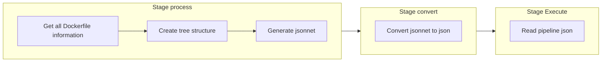
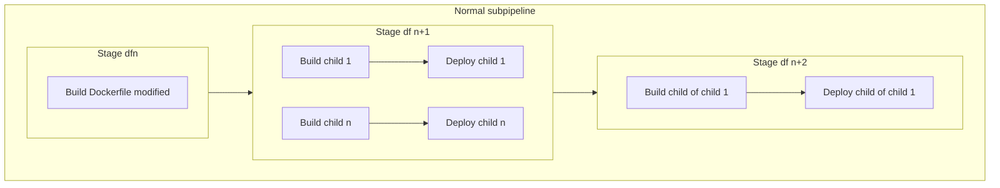
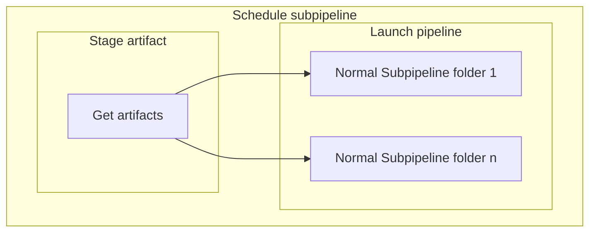

# GitLab CI Pipeline Présentation

Ce projet utilise une **pipeline GitLab CI/CD modulaire**, organisée autour d'un fichier parent `.gitlab-ci.yml` qui inclut plusieurs blocs YAML spécifiques à chaque fonctionnalité.

---

## Installation de la CI dans un Gitlab

### Mise en place d'un groupe CICD

Pour faciliter l'installation, il est conseillé de créer un groupe CICD dans votre Gitlab. Ce groupe sera composé de plusieurs projets :
* **cicd-yaml** : Contient les yaml constituant la CI avec les templates de la configuration à mettre en place.
* **cicd-script** : Contient les script utilisés par la CI pour ces features.
* **cicd-docker** : Contient des images dockers utilisées par la CI pour ces features
* **cicd-configuration** : Contient la configuration des projets permettant de personnaliser la CI et configurer automatiquement les autres projets pour qu'ils puissent utiliser la CI.

### Initialisation de la CI

#### Initialisation du projet cicd-configuration

Pour initialiser le projet cicd-configuration, il faut récupérer ce qu'il y'a dans cicd-configuration.template dans ce repo et créez votre propre configuration en fonction de votre environnement. Les fichiers devront avoir le même nom avec le .template en moins (ex : .default-conf.yml au lieu de .default-conf.template.yml). 

A noté que vous pouvez mettre la configuration dans n'importe quel projet tant que la configuration est à la racine mais il est vivement conseillé de le séparer dans un projet différent.

Ensuite, il faut respecter les étapes suivantes :

1) Configurer les variables ci suivantes dans Settings/CI/CD/Variables/Project variables : 
* **DOCKERHUB_TOKEN** : Un token d'accès à dockerhub qui permet le pull des images
* **CICD_GITLAB_ADMIN_TOKEN** : Un token utilisateur admin de gitlab pour permettre la configuration des projets. A savoir qu'on peut changer son nom dans la configuration avec la variable `SETUP_GITLAB_TOKEN_NAME`.
* **CICD_CONFIGURATION_PATH** : Le chemin du projet cicd-configuration (ex : `cicd/cicd-configuration`).
* **SETUP** : La variable permettant au projet d'utiliser la pipeline de configuration automatique des projets. Elle doit avoir pour valeur `yes`.

2) Configurer l'option CI/CD configuration file dans Settings/CI/CD/General pipelines et mettre `.gitlab-ci.yml@cicd/cicd-yaml`. (La valeur dependra de votre organisation de Groupe gitlab)

#### Initialisation du projet cicd-docker

Pour pouvoir initialiser le projet cicd-docker et donc permettre l'utilisation des images nécéssaires à la CI (image builder, image python...). Il faut respecter les étapes suivantes :

1) Configurer les variables ci suivantes dans Settings/CI/CD/Variables/Project variables : 
* **DOCKERHUB_TOKEN** : Un token d'accès à dockerhub qui permet le pull des images
* **CICD_CONFIGURATION_PATH** : Le chemin du projet cicd-configuration (ex : `cicd/cicd-configuration`).

2) Configurer l'option CI/CD configuration file dans Settings/CI/CD/General pipelines et mettre `.gitlab-ci.yml@cicd/cicd-yaml`. (La valeur dependra de votre organisation de Groupe gitlab)

3) Lancer une pipeline avec comme variable `INIT=yes`

---

## Configuration d'un projet pour utiliser le module build-docker

Pour comprendre comment marche le build et ces fonctionnalités, voir la documentation dans cicd-yaml.

### Explication

Pour configurer un projet afin qu'il puisse build des images dockers, dans le dossier build-docker/setup, vous pouvez créer un fichier dedié au projet qui se fait trigger (`ex : mon-project.build.yml) ou tout simplement le mettre dans le fichier triggers.yml. Ce fichier doit respecter la forme suivante :

```yaml
- name: "NOM_DE_MON_PROJET_A_SETUP"
  id : ID_DE_MON_PROJET_A_SETUP
```

### Arguments possibles

| Argument     | Valeurs possibles     | Obligatoire | Comportement associé               |
|--------------|-----------------------|-------------|------------------------------------|
| `name:`      | Nom de mon projet/pipeline | oui         |Nom du projet gitlab à configurer pour build des images dockers|
| `id:`      | ex : 22443 | oui pour gitlab        |ID du projet gitlab à configurer|
| `instance_to_allow::`      | Liste de champ YAML | oui         |Instance (Groupe ou Project) à mettre dans les allowlists de la CI pour permettre la communication entre elles|
| `instance_to_allow:  instance_type:`      | 'project' (par défaut) ou 'group'  | oui         |Type de l'instance à autoriser|
| `instance_to_allow:  name:`      | Nom de mon instance  | oui         |Nom de l'instance à autoriser|
| `instance_to_allow:  id:`      | ex : 22444  | oui         |Id de l'instance à autoriser|
| `schedule: `      | Liste  | non         |Permet de choisir quels types de schedules configurer pour le projet |
| `schedule:  type:`      | ex : 'buildall'  | oui         |Type de schedule à configurer|
| `schedule:  branch:`      | ex : 'main'  | non         |La branche sur lequel lancer le schedule |
| `schedule:  cron:`      | ex: '0 20 * * *'  | non         |Le cron du schedule|
| `schedule:  variables:`      | Liste de champ YAML | non         |Override des variables par défaut du schedule, doit être au format "MON_NOM_DE_VARIABLE" : "MA_VALEUR"|

### Exemple

```yaml
- name: "cicd-docker"
  id: 27188
  instance_to_allow:
    - instance_type : 'group'
      name : 'CICD'
      id : 4
  schedule:
    - type : "buildall"
      branch: "refs/heads/preprod"
      cron: "0 20 * * *"
    - type : "buildall"
      branch: "refs/heads/prod"
      cron: "0 22 * * *"
    - type : "cleanlog"
      variables:
        CLEANLOG_WEEKS_LIMIT: 1
```

## Configuration d'un trigger

### Configuration dans le projet cicd-configuration

Pour comprendre comment marche le trigger et ces fonctionnalités, voir la documentation dans cicd-yaml.

#### Explication

Pour configurer un projet afin qu'il puisse trigger un autre projet, dans le dossier trigger-project/setup, vous pouvez créer un fichier dedié au projet qui se fait trigger (`ex : mon-project.triggers.yml) ou tout simplement le mettre dans le fichier triggers.yml. Ce fichier doit respecter la forme suivante :

```yaml
- type: "gitlab" #ou "jenkins"
  name: "NOM_DE_MON_PROJET_A_TRIGGER" #ou "NOM_DE_MA_PIPELINE_JENKINS"
  id : ID_DE_MON_PROJET_A_TRIGGER #'si type == gitlab'
  projects:
    - name: "NOM_DE_MON_PROJET"
      id: ID_DE_MON_PROJET
```

#### Arguments possibles

| Argument     | Valeurs possibles     | Type autorisé            | Obligatoire | Comportement associé               |
|--------------|-----------------------|--------------------------|-------------|------------------------------------|
| `type:`      | "gitlab" ou "jenkins" seulement | **gitlab** / **jenkins** | oui         |Type du projet à trigger            |
| `name:`      | Nom de mon projet/pipeline | **gitlab** / **jenkins** | oui         |Nom du projet gitlab à trigger où nom de la pipeline jenkins à trigger|
| `id:`      | ex : 22443 | **gitlab** | oui pour gitlab        |ID du projet gitlab à trigger|
| `projects:`      | Liste de champ YAML | **gitlab** / **jenkins** | oui         |Projets à configurer pour trigger le projet ou la pipeline correspondante|
| `projects:  name:`      | Nom de mon projet  | **gitlab** / **jenkins** | oui         |Nom du projet à configurer|
| `projects:  id:`      | ex : 22444  | **gitlab** / **jenkins** | oui         |Id du projet à configurer|
| `projects:  trigger_files:`      | Liste  | **gitlab** / **jenkins** | non         |Permet de choisir pour quel fichier le trigger est lancé|
| `projects:  branchs_only_trigger:`      | Liste  | **gitlab** / **jenkins** | non         |Permet de choisir pour quel branche le trigger est lancé|
| `projects:  branchs_mapping:`      | Liste de champ YAML  | **gitlab** / **jenkins** | non         |Permet de définir un mapping de branches lors du trigger|
| `projects:  change_ci:`      | Booléan  | **gitlab** / **jenkins** | non         |Si mis à False, empêche la configuration du CI/CD configuration file |
| `projects:  focus_trigger:`      | Booléan  | **gitlab** | non         |Permet de choisir si le trigger doit être précis en fonction des changements des fichiers|
| `projects:  additional_params:`      | JSON ex : `{"param1": "value1", "param2": "value2"}`  | **jenkins** | non         |Permet de rajouter des paramètres pour sa pipeline|
| `dependencies:`      | Liste de champ YAML | **gitlab** | non         |Projets à mettre dans la liste d'autorisation des projets à configurer pour le bon fonctionnement du process|
| `dependencies: type:`      | "gitlab" seulement | **gitlab** | non         |Type du projet à mettre dans la liste d'autorisation|
| `dependencies: name:`      | Nom de mon projet | **gitlab** | non         |Nom du projet à mettre dans la liste d'autorisation|
| `dependencies: id:`      | ex : 22445  | **gitlab** | non         |Id du projet à mettre dans la liste d'autorisation|

#### Exemple

```yaml
- type: "gitlab"
  name: "mel-docker"
  id: 11665
  dependencies:
    - type: "gitlab"
      name: "gmcd-docs"
      id: 25419
  projects:
    - name: "cicd-trigger"
      id: 22822
      trigger_files: ["triggers.yml","*.py"]
      focus_trigger: True
      branchs_only_trigger: ["main","ht-reworkv2"]
      branchs_mapping: 
        main: 'prod'
        ht-reworkv2: 'preprod'
- type: "jenkins"
  name: "Gitlab Trigger Configuration"
  projects:
    - name: "cicd-trigger"
      id: 22822
      trigger_files: ["triggers.yml"]
      branchs_only_trigger: ["main"]
      branchs_mapping: 
        main: 'prod'
```

### Configuration du projet qui trigger (Optionnel)

#### Explication

Il est possible de rajouter un fichier `trigger_parameters.yml` à la racine du projet afin de pouvoir configurer directement vos triggers.

**Pré-requis** : Avoir au préalable fait l'étape de Mise en place dans le projet cicd-trigger.

Votre fichier `trigger_parameters.yml` peut avoir la forme suivante :

```yaml
- name: "NOM_DE_MON_PROJET_A_TRIGGER" #ou "NOM_DE_MA_PIPELINE_JENKINS"
  type: "gitlab" #ou "jenkins"
  mon_option: ma_valeur
```

Les options pouvant être rajoutés sont les mêmes que dans le projet cicd-trigger :  

- trigger_files
- branchs_only_trigger
- branchs_mapping
- focus_trigger

**ATTENTION :** Le nom du projet à trigger doit être exactement le même que celui assigné dans le projet cicd-trigger. 
#### Exemple

```yaml
- name: "mel-docker"
  type: "gitlab"
  trigger_files: ["triggers.yml","*.py"]
  focus_trigger: True
  branchs_only_trigger: ["main","ht-reworkv2"]
  branchs_mapping: 
    main: 'prod'
    ht-reworkv2: 'preprod'
- name: "Gitlab Trigger Configuration"
  type: "jenkins"
  trigger_files: ["triggers.yml"]
  branchs_only_trigger: ["main"]
  branchs_mapping: 
    main: 'prod'
```

---

## Structure générale

```
.gitlab-ci.yml           # Fichier parent principal
ci/
├── init.yml             # Bloc pour l'initialisation de cicd-yaml
├── build-docker.yml     # Bloc pour la construction des images Docker
├── trigger-project.yml  # Bloc pour le trigger inter-projets
├── setup-project.yml    # Bloc pour la configuration des projets
├── clean-log.yml        # Bloc pour le nettoyage des logs gitlab
├── clean-registry.yml   # Bloc pour le nettoyage des images Docker
```

### Fichier parent `.gitlab-ci.yml`

Le fichier parent est responsable de :

* Inclure les blocs YAML spécifiques pour chaque feature via `include`
* Definir le workflow général de la pipeline (changement de variables en fonction du type de lancement, création d'argument générique qu'on peut mettre en message de commit etc..)
* Définir un tag par défaut pour les runners gitlab.
* Définir les **stages** globaux de la pipeline (`prepare`, `process`, `deploy`, etc.)
* Définir le stage en commun entre toutes les features, la récupération du projet de script cicd-script :

```yaml
include:
  [...]
  - local: "features/build-docker.yml"
    rules:
      - exists:
          - features/build-docker.yml
  [...]

workflow:
  name: "$PIPELINE_DISPLAY_NAME"
  rules:
    # --------------------- 
    # --- NAME PIPELINE ---
    # ---------------------
    - if: $CI_PIPELINE_SOURCE =~ /^(schedule|web)/
      variables:
        PIPELINE_DISPLAY_NAME: "[$CI_PIPELINE_SOURCE] $CI_COMMIT_MESSAGE"
    [...]

default:
  tags:
    - $RUNNER_TAGS

stages:
  - prepare
  - process
  - deploy
  [...]

get-files-from-git:
  stage: prepare
  [...]
```

### Blocs YAML modulaires

Chaque fichier inclus contient uniquement la configuration nécessaire à une fonctionnalité particulière :

* **init.yml** : Initialisation des images python-process et jsonnet-folder pour pouvoir lancer les différentes features.
* **build-docker.yml** : Construction des images Docker, push vers le registry et deploiement dans l'infra.
* **trigger-project.yml** : Trigger d'un projet vers un autre projet Gitlab ou tout autre webhooks (ex: Jenkins).
* **setup-project.yml** : Configuration des projets pour permettre les différentes features (Build et Trigger).
* **clean-log.yml** : Nettoyage périodique des logs pour éviter la saturation de Gitlab.
* **clean-registry.yml** : Nettoyage périodique des images en fonction de leurs statuts (Image plus build ou image d'une branche dev supprimé) pour éviter la saturation de Gitlab.

### Guide d'installation

Pour pouvoir utiliser tout type de modules, il faudra au préalable faire les étapes suivantes :

1) Récupérer l'image docker `gcr.io/kaniko-project/executor:v1.19.2-debug` et la push dans la registry de cicd-docker avec comme nom `ma_registry/mon_path/cicd-docker/kaniko-executor:v1.19.2-debug`.
2) Builder en local l'image dans cicd-docker/reg-image-builder/2.0/Dockerfile et la push dans la registry de cicd-docker avec comme nom `ma_registry/mon_path/cicd-docker/reg-image-builder:2.0-prod`. 
3) Crée la CI variable `CICD_CONFIGURATION_PATH` dans le projet cicd-docker avec comme valeur le chemin du projet cicd-configuration (ex : `cicd/cicd-configuration`).
4) Lancer une pipeline avec comme variable d'environnement `INIT=yes` pour lancer la construction des images python-process et jsonnet-folder. 

### Arguments spécifiques

Si le message du commit (et donc la variable `$CI_COMMIT_MESSAGE`) contient l'un (ou plusieurs) des arguments listés ci-dessous, le comportement de la pipeline associée est modifié.

| Objectif          | Argument                  | Comportement associé |
|-------------------|---------------------------|----------------------|
| Opérationnel      | `no-build`                | Ne lance pas de pipeline associé au push |
| Reconstruction    | `ci-all`                  | Reconstruction de toutes les images, que les fichiers associés à ces images aient été modifiés ou non|
| Reconstruction    | `ci-check-before-push`    | Push de l'image vers la registry seulement si des différences entre l'image construite par la pipeline et l'image déjà stockée sur la registry sont constatées|
| Reconstruction    | `ci-branch-dev`    | Lance la reconstruction sur la pipeline de développement|
| Nettoyage         | `ci-clean-dev`            | Lancement du module clean-registry mode suppression image dev|
| Nettoyage         | `ci-clean-nobuild`        | Lancement du module clean-registry mode suppression image no build|
| Nettoyage         | `ci-clean-log`        | Lancement du module clean-log |

#### Exemples
- `ci-all && ci-check-before-push` pour forcer la reconstruction de toutes les images, sans les push si c'est inutile
- `ci-clean-nobuild && ci-clean-dev` pour nettoyer les anciennes versions, et les version de dev obselète.

### Build-docker module

#### Prérequis

Pour pouvoir utiliser le module build-docker, il faut d'abord respecter ces étapes :

1) Avoir cicd-configuration de configurer avec les variables ci suivantes : 
* **DOCKERHUB_TOKEN** : Un token d'accès à dockerhub qui permet le pull des images
* **CICD_GITLAB_ADMIN_TOKEN** : Un token utilisateur admin de gitlab pour permettre la configuration des projets. A savoir qu'on peut changer son nom dans la configuration avec la variable `SETUP_GITLAB_TOKEN_NAME`.
* **CICD_CONFIGURATION_PATH** : Le chemin du projet cicd-configuration (ex : `cicd/cicd-configuration`).

2) Avoir rentrer son projet dans le fichier `setup/build.yml` en respectant la documentation.

#### Lancement

Le module se déclenche à chaque push/merge d'un utilisateur sauf pour la création d'une nouvelle branche dans un projet configuré au préalable par le module de setup (ENABLE_BUILD = 'yes').

#### Etapes

La pipeline principale est séparé en 3 étapes : `process`, `convert`, `execute`. 

La première étape `process` suit l'étape `prepare` et lance le script python correspondant qui va récuperer les informations de toutes les images docker présente dans le repo où la pipeline est lancée grâce à l'architecture général. Chaque image docker aura son parent associé (via le dernier FROM du Dockerfile) permettant de faire le lien entre chacun. Ces derniers seront séparés par couches (df0, df1 ...) où plus on est dans une couche supérieur (df1 > df0 ) et plus on a de parents. Enfin, le script crée un nouveau .jsonnet qui va permettre d'automatiquement crée un nouveau .yaml avec toutes les informations nécessaire. Si ci-all est dans le message du commit, la conversion se fera en plusieurs jsonnet pour éviter d'avoir trop de build pour une seule sous-pipeline.

La deuxième étape `convert` suit l'étape `process` convertit le .jsonnet en .yaml et le stock.

La troisième étape `execute` suit l'étape `convert` et lance le nouveau .yaml en tant que pipeline enfant. Ce pipeline est une succession de build des couches df0 à dfn avec n le nombre de couche au total. Dans le cas où toutes les images sont builds (schedule), chacune des images devra attendre que le build de son parent reussisse avant de se lancer et, dans le cas contraire, le build ne se passera pas. Dans le cas où seul l'image modifié doit être build, les builds d'elle et ses enfants seront lancés (Si l'image parent non build n'existe pas dans le registry, l'image preprod sera récupéré à la place). L'image est ensuite push dans la registry et un job peut suivre celui du build qui déclenche le déploiement.

#### Schémas explicatif

##### Pipeline principale



##### Sous pipelines





---

## Avantages de cette approche

* **Lisibilité** : Chaque bloc est autonome et facile à comprendre.
* **Réutilisabilité** : Les blocs peuvent être inclus dans d’autres pipelines.
* **Maintenance simplifiée** : Modification d’une feature sans toucher au reste de la pipeline.
* **Scalabilité** : Ajout facile de nouvelles fonctionnalités CI/CD en créant simplement un nouveau bloc YAML.

---

## Bonnes pratiques

* Nommer les fichiers YAML de manière claire (`build-*.yml`, `clean-*.yml`).
* Garder les jobs modulaires et indépendants.
* Documenter chaque bloc YAML avec un commentaire sur son rôle.
