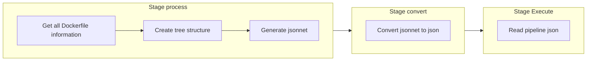
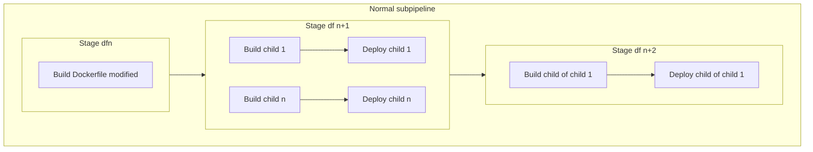
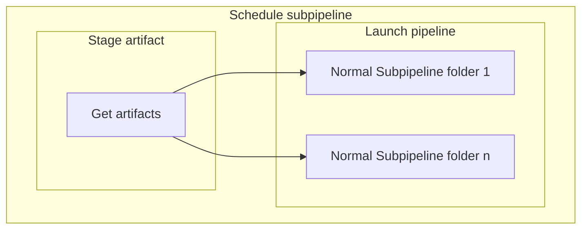

# Build-docker module

## Prérequis

Pour pouvoir utiliser le module build-docker, il faut d'abord respecter ces étapes :  

1) Avoir cicd-configuration de configurer avec les variables ci suivantes :   
* **DOCKERHUB_TOKEN** : Un token d'accès à dockerhub qui permet le pull des images  
* **CICD_GITLAB_ADMIN_TOKEN** : Un token utilisateur admin de gitlab pour permettre la configuration des projets. A savoir qu'on peut changer son nom dans la configuration avec la variable `SETUP_GITLAB_TOKEN_NAME`.  
* **CICD_CONFIGURATION_PATH** : Le chemin du projet cicd-configuration (ex : `cicd/cicd-configuration`).  

2) Avoir rentrer son projet dans le fichier `setup/build.yml` en respectant la documentation.  

## Lancement

Le module se déclenche à chaque push/merge d'un utilisateur sauf pour la création d'une nouvelle branche dans un projet configuré au préalable par le module de setup (ENABLE_BUILD = 'yes').

## Etapes

La pipeline principale est séparé en 3 étapes : `process`, `convert`, `execute`. 

La première étape `process` suit l'étape `prepare` et lance le script python correspondant qui va récuperer les informations de toutes les images docker présente dans le repo où la pipeline est lancée grâce à l'architecture général. Chaque image docker aura son parent associé (via le dernier FROM du Dockerfile) permettant de faire le lien entre chacun. Ces derniers seront séparés par couches (df0, df1 ...) où plus on est dans une couche supérieur (df1 > df0 ) et plus on a de parents. Enfin, le script crée un nouveau .jsonnet qui va permettre d'automatiquement crée un nouveau .yaml avec toutes les informations nécessaire. Si ci-all est dans le message du commit, la conversion se fera en plusieurs jsonnet pour éviter d'avoir trop de build pour une seule sous-pipeline.

La deuxième étape `convert` suit l'étape `process` convertit le .jsonnet en .yaml et le stock.

La troisième étape `execute` suit l'étape `convert` et lance le nouveau .yaml en tant que pipeline enfant. Ce pipeline est une succession de build des couches df0 à dfn avec n le nombre de couche au total. Dans le cas où toutes les images sont builds (schedule), chacune des images devra attendre que le build de son parent reussisse avant de se lancer et, dans le cas contraire, le build ne se passera pas. Dans le cas où seul l'image modifié doit être build, les builds d'elle et ses enfants seront lancés (Si l'image parent non build n'existe pas dans le registry, l'image preprod sera récupéré à la place). L'image est ensuite push dans la registry et un job peut suivre celui du build qui déclenche le déploiement.

## Schémas explicatif

### Pipeline principale

### Sous pipelines

---