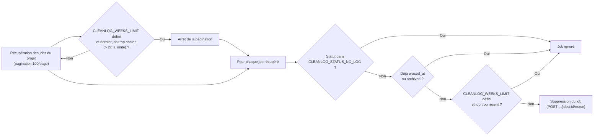

# Clean-log module

Supprime les logs et artéfacts des jobs GitLab CI d'un projet, afin d'éviter la saturation du stockage GitLab. Peut effacer soit tous les jobs éligibles, soit seulement ceux plus anciens qu'une limite donnée.

## Projets concernés

| Projet | Rôle dans la feature |
|------|----------------------|
| `cicd-yaml` | Définition du job (`features/clean-log.yml`) |
| `cicd-script` | Logique Python (`clean_log/`) |
| `cicd-configuration` | Variables du projet + schedule éventuel |

## Fonctionnement du script



1. `get_jobs_info` récupère la liste des jobs du projet via l'API GitLab (`GET /projects/:id/jobs`), page par page (100 jobs max par page).
2. Si `CLEANLOG_WEEKS_LIMIT` est défini, `check_week_limit` arrête la pagination dès que le dernier job récupéré a démarré il y a plus de `2 × CLEANLOG_WEEKS_LIMIT` semaines — cela évite de parcourir tout l'historique du projet tout en s'assurant d'avoir bien récupéré tous les jobs à supprimer.
3. `process_jobs` parcourt ensuite chaque job récupéré et l'efface (`delete_job_artifacts`, `POST /projects/:id/jobs/:job_id/erase`) sauf si :
   - son statut fait partie de `CLEANLOG_STATUS_NO_LOG` (par défaut `skipped`, `canceled`), ou
   - il est déjà effacé (`erased_at` non nul), ou
   - il est archivé (`archived: true`, GitLab interdit alors l'effacement), ou
   - `CLEANLOG_WEEKS_LIMIT` est défini et que le job a démarré il y a moins de `CLEANLOG_WEEKS_LIMIT` semaines (job conservé).

## Prérequis

- Un token d'API GitLab avec les droits suffisants sur le projet (`CICD_GMCD_TOKEN`).

## Déclenchement

Le job `clean-job` (stage `clean`) se lance dès que le message de commit contient `ci-clean-log` :

```
ci-clean-log
```

## (optionnel) Configuration du schedule

Il est possible de programmer un nettoyage périodique via le type de schedule `cleanlog`, à ajouter dans la configuration `setup` du projet (voir [BUILD_SETUP.md](../setup/BUILD_SETUP.md) pour la syntaxe des schedules) :

```yaml
- name: "mon-projet"
  id: <project_id>
  schedule:
    - type: "cleanlog"
      variables:
        CLEANLOG_WEEKS_LIMIT: 2
```

Le comportement par défaut du type `cleanlog` (défini via `SETUP_SCHEDULE_TYPE` dans `cicd-configuration`) lance un commit avec le message `[cleanlog] ci-clean-log` toutes les 5 jours.

### Variables (`cicd-configuration/configuration/by_project/.<projet>-conf.yml`)

```yaml
variables:
  #================== Features variables =================#
  CLEAN_LOG_LOG_LEVEL: "DEBUG"                # Défaut : INFO
  CLEANLOG_STATUS_NO_LOG: "skipped,canceled"  # Défaut : skipped,canceled
  CLEANLOG_WEEKS_LIMIT: 2                     # Défaut : vide (tous les jobs éligibles sont effacés)
```

## Résultat

Les jobs GitLab CI ciblés du projet voient leurs logs et artéfacts effacés (`erased_at` renseigné côté GitLab). Les jobs déjà effacés, archivés, trop récents ou aux statuts exclus sont conservés tels quels.

---
