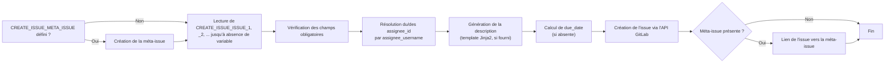

# Create-issue module

Crée automatiquement une ou plusieurs issues GitLab depuis la pipeline CI/CD, avec assignation par nom d'utilisateur, description générée par template Jinja2, échéance par défaut, et regroupement optionnel sous une « méta-issue ».

## Projets concernés

| Projet | Rôle dans la feature |
|------|----------------------|
| `cicd-yaml` | Définition du job (`features/create-issue.yml`) |
| `cicd-script` | Logique Python (`create_issue/`) |
| Projet cible | Variables `CREATE_ISSUE_ISSUE_*` (peuvent être définies au niveau du commit/du pipeline ou en configuration projet) et templates de description (fichiers du repo) |

## Fonctionnement du script



1. Si la variable `CREATE_ISSUE_META_ISSUE` (JSON) est définie, une première issue « méta » est créée : elle servira de parent auquel toutes les autres issues seront liées.
2. Le script lit ensuite séquentiellement les variables `CREATE_ISSUE_ISSUE_1`, `CREATE_ISSUE_ISSUE_2`, ... (chacune un JSON décrivant une issue) jusqu'à en trouver une absente — il n'y a donc pas de limite fixe au nombre d'issues créées en une pipeline.
3. Pour chaque issue, `check_field` vérifie la présence des champs obligatoires (`CREATE_ISSUE_ISSUE_MANDATORY_PARAMETER`, par défaut `title` et `assignee_username`).
4. `get_user_id` résout le ou les noms d'utilisateur (`assignee_username`, séparés par des virgules pour assigner plusieurs personnes — une issue est alors créée par assignee) en id GitLab, via l'API `get_users` du projet cible (`project_id`, ou le projet courant par défaut).
5. Si `CREATE_ISSUE_ISSUE_<n>_DESCRIPTION_TEMPLATE_PATH` est fourni, `create_description` rend un template Jinja2 (situé dans le repo, chargé depuis `project_dir`) avec des données lues depuis des variables `CREATE_ISSUE_ISSUE_<n>_TEMPLATE_DATA_<i>_KEY` / `_TYPE` (`str`, `list` ou `dict`) / `_VALUE`.
6. `get_due_date` calcule une échéance par défaut (`due_date` = aujourd'hui + `CREATE_ISSUE_ISSUE_DEADLINE` jours) si elle n'est pas fournie dans l'issue.
7. `create_issue_payload` ne garde que les champs autorisés (`CREATE_ISSUE_ISSUE_MANDATORY_FIELD` + `CREATE_ISSUE_ISSUE_OTHER_FIELD`, ex : `title`, `assignee_id`, `description`, `labels`, `milestone_id`, `due_date`, `issue_type`) avant l'appel à l'API GitLab de création d'issue.
8. Si une méta-issue existe, chaque issue créée est liée à celle-ci (`create_issue_link`).

## Prérequis

- Un token d'API GitLab avec les droits suffisants (`CICD_GMCD_TOKEN`).
- Au minimum une variable `CREATE_ISSUE_ISSUE_1` définie (JSON), avec les champs obligatoires `title` et `assignee_username`.

## Déclenchement

Le job `create-issue` (stage `manage`) se lance uniquement si `LAUNCH_FEATURE` contient `create-issue` :

```
LAUNCH_FEATURE = create-issue
```

## Variables

| Variable | Défaut | Rôle |
|----------|--------|------|
| `CREATE_ISSUE_LOG_LEVEL` | `INFO` | Niveau de log du script |
| `CREATE_ISSUE_ISSUE_<n>` | — | JSON décrivant l'issue n° `n` à créer (`title`, `assignee_username`, `description`, `labels`, ...) |
| `CREATE_ISSUE_ISSUE_<n>_DESCRIPTION_TEMPLATE_PATH` | — | Chemin (dans le repo) d'un template Jinja2 pour générer la description de l'issue n° `n` |
| `CREATE_ISSUE_ISSUE_<n>_TEMPLATE_DATA_<i>_KEY` / `_TYPE` / `_VALUE` | — | Données injectées dans le template (i = 1, 2, ... jusqu'à absence de clé), `_TYPE` = `str` (défaut), `list` ou `dict` |
| `CREATE_ISSUE_META_ISSUE` | `{}` | JSON de la méta-issue parente (mêmes champs qu'une issue classique) |
| `CREATE_ISSUE_ISSUE_MANDATORY_PARAMETER` | `title,assignee_username` | Champs obligatoires en entrée avant résolution des assignees |
| `CREATE_ISSUE_ISSUE_MANDATORY_FIELD` | `title,assignee_id` | Champs obligatoires avant l'appel API (après résolution) |
| `CREATE_ISSUE_ISSUE_OTHER_FIELD` | `description,labels,milestone_id,due_date,issue_type` | Champs optionnels transmis à l'API s'ils sont présents |
| `CREATE_ISSUE_ISSUE_DEADLINE` | `5` | Nombre de jours ajoutés à la date du jour pour calculer `due_date` par défaut |

## Exemple

```yaml
variables:
  LAUNCH_FEATURE: "create-issue"
  CREATE_ISSUE_ISSUE_1: >
    {"title": "Dette technique détectée", "assignee_username": "jdupont,mmartin", "labels": ["dette-technique"]}
```

## Résultat

Une (ou plusieurs, une par assignee) issue est créée dans le projet cible, avec assignation, échéance et description renseignées. Si une méta-issue est configurée, chaque issue créée y est liée.

---
