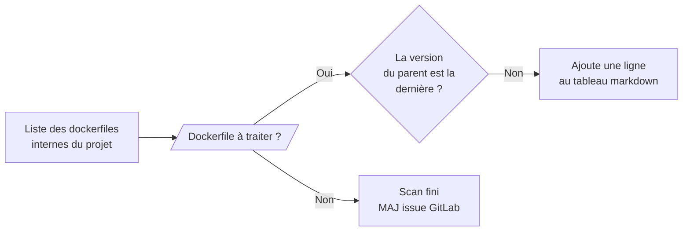
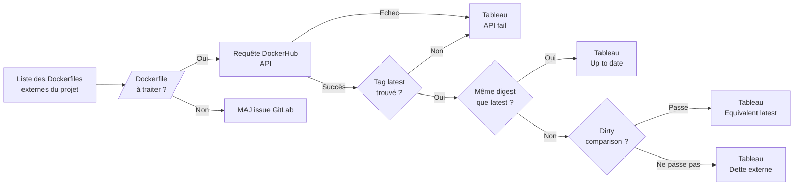

# Detect-debt module

Détecte la dette technique dans un projet Docker. Deux sous-features indépendantes, chacune créant ou mettant à jour une issue GitLab dédiée :

- **Dette interne** : images utilisant un parent interne dans une version inférieure à la dernière disponible dans le projet.
- **Dette externe** : images dont le parent provient de DockerHub et n'est plus à jour par rapport au tag `latest`.

## Projets concernés

| Projet | Rôle dans la feature |
|------|----------------------|
| `cicd-yaml` | Définition du job (`features/detect-debt.yml`) |
| `cicd-script` | Logique Python (`detect_debt/`) |
| `cicd-configuration` | Configuration par projet (variables + schedule) |

## Fonctionnement

### Dette interne



1. Scanne le projet cible avec `find_dockerfiles_r` (feature `build_docker`)
2. Pour chaque image dont le parent est **interne** (`parent.external = False`), compare la version utilisée avec la dernière disponible dans le projet
3. Construit un tableau markdown des images en retard
4. Crée ou met à jour l'issue GitLab correspondant à `DETECT_INTERNAL_DEBT_ISSUE_TITLE`

### Dette externe



1. Scanne le projet cible, filtre les Dockerfiles **externes** (`parent.external = True`)
2. Pour chaque image, interroge l'API DockerHub pour récupérer le digest de la version utilisée et celui de `latest`
3. Si les digests diffèrent, applique optionnellement la **dirty comparison** : une image est considérée à jour si l'un de ses tags commence par un tag de `latest` (ex. `13.4-slim` vs `13.4`)
4. Construit quatre tableaux markdown : dette externe, equivalent latest, API fail, up to date (optionnel)
5. Crée ou met à jour l'issue GitLab correspondant à `DETECT_EXTERNAL_DEBT_ISSUE_TITLE`

## Déclenchement manuel

Depuis GitLab → **CI/CD > Pipelines > Run pipeline**, avec la variable :

```
LAUNCH_FEATURE = detect-debt
```

## Configuration

### Variables communes

```yaml
# cicd-configuration/configuration/by_project/.<projet>-conf.yml
variables:
  DETECT_DEBT_LOG_LEVEL: "DEBUG"    # Défaut : INFO
```

### Dette interne

```yaml
variables:
  DETECT_INTERNAL_DEBT_ISSUE_TITLE: "[Internal technical debt]"  # Défaut : [Internal technical debt]
  DETECT_INTERNAL_DEBT_ISSUE_LABEL: "En prod"                    # Défaut : En prod
  DETECT_INTERNAL_DEBT_ISSUE_ASSIGNEE_USERNAME: ""               # Défaut : vide (non assigné)
  DETECT_INTERNAL_DEBT_ACTIVATE_ISSUE: True                      # Défaut : True
  DETECT_INTERNAL_DEBT_ACTIVATE_JOB: True                        # Défaut : True
```

### Dette externe

```yaml
variables:
  DETECT_EXTERNAL_DEBT_ISSUE_TITLE: "[External technical debt]"  # Défaut : [External technical debt]
  DETECT_EXTERNAL_DEBT_ISSUE_LABEL: "En prod"                    # Défaut : En prod
  DETECT_EXTERNAL_DEBT_ISSUE_ASSIGNEE_USERNAME: ""               # Défaut : vide (non assigné)
  DETECT_EXTERNAL_DEBT_ACTIVATE_ISSUE: True                      # Défaut : True
  DETECT_EXTERNAL_DEBT_ACTIVATE_JOB: True                        # Défaut : True
  DETECT_EXTERNAL_DEBT_ACTIVATE_DIRTY_COMPARAISON: True          # Défaut : True
  DETECT_EXTERNAL_DEBT_ACTIVATE_UP_TO_DATE_TABLE: False          # Défaut : False
```

### Schedule (optionnel)

Dans `cicd-configuration/setup/build.yml`, ajouter un schedule de type `detectdebt` pour le projet :

```yaml
- name: "mon-repo-docker"
  id: <project_id>
  schedule:
    - type: "detectdebt"
      branch: "refs/heads/main"
      cron: "0 2 * * 5"
      cron_timezone: "Europe/Paris"
      description: "[detect-debt] Détection de dette technique"
      variables:
        LAUNCH_FEATURE: "detect-debt"
```

## Résultat

### Issue dette interne

| Dockerfile | Parent actuel | Dernière version |
|------------|---------------|-----------------|
| `path/to/Dockerfile` | `nom-image 1.0_2.3` | `2.5` |

### Issue dette externe

**Dette externe** — images dont le digest diffère de `latest` et qui ne passent pas la dirty comparison :

| Dockerfile | Version actuel | Latest tags | Enfants concernés |
|------|------|------|------|
| `path/to/Dockerfile` | `3.10-slim` | `3.13, 3.13.3` | `- path/child` |

**Equivalent latest** — images dont le digest diffère de `latest` mais dont le tag correspond à une variante de `latest` (dirty comparison) :

| Dockerfile | Version actuel | Tags correspondants | Latest tags | Enfants concernés |
|----|----|----|----|----|
| `path/to/Dockerfile` | `13.4-slim` | `13.4-slim, 13.4` | `13, 13.4, 13.4.0` | `- path/child` |

**Dockerhub API fail** — regroupe deux cas distincts dans le code (`get_external_debt_description`, branche `else` du `if latest_tag_info`) : requête API échouée (`last_page_requested == 0` après appel) ET tag `latest` introuvable dans les résultats. Les deux alimentent `description_failed`. À séparer en deux tableaux si besoin de les distinguer.

| Dockerfile | Version actuel |
|----|----|
| `path/to/Dockerfile` | `nom-image 3.10-slim` |

**Up to date** *(si `DETECT_EXTERNAL_DEBT_ACTIVATE_UP_TO_DATE_TABLE: True`)* :

| Dockerfile | Version actuel | Latest tags |
|----|----|-----|
| `path/to/Dockerfile` | `3.13-slim` | `3.13, 3.13.3` |
