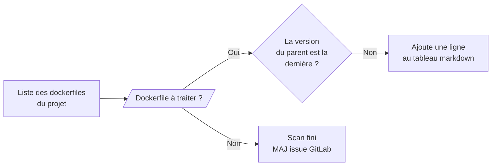

# Detect-debt module

Détecte la dette technique interne dans un projet. On cherche les images qui utilisent un parent interne (qui ne provient pas de DockerHub) dans une version inférieure à la dernière disponible. Crée ou met à jour une issue GitLab avec le tableau de résultat.

## Projets concernés

| Projet | Rôle dans la feature |
|------|----------------------|
| `cicd-yaml` | Définition du job (`features/detect-debt.yml`) |
| `cicd-script` | Logique Python (`detect_debt/`) |
| `cicd-configuration` | Configuration par projet (variables + schedule) |

## Fonctionnement du script



1. Scanne le projet cible pour trouver tous les Dockerfiles avec `find_dockerfiles_r` de la feature `build_docker`
2. Pour chaque image dont le parent est **interne** (`parent.external = False`), compare la version utilisée avec la dernière version disponible dans le projet
3. Construit un tableau markdown des images en retard
4. Crée ou met à jour l'issue GitLab dont le titre correspond à `DETECT_DEBT_ISSUE_TITLE`

## Prérequis

- Le projet cible doit être listé dans `cicd-configuration/setup/build.yml`

## Déclenchement manuel

Depuis GitLab → **CI/CD > Pipelines > Run pipeline**, avec la variable :

```
LAUNCH_FEATURE = detect-debt
```

## (optionnel) Configuration du schedule

### 1. Activer la feature (`cicd-configuration/setup/build.yml`)

Ajouter un schedule de type `detectdebt` pour le projet. Voir la config par défaut dans `cicd-yaml/configuration/.default-conf.yml`

```yaml
- name: "mon-repo-docker"
  id: <project_id>
  schedule:
    - type: "detectdebt"
      branch: "refs/heads/main"
      cron: "0 2 * * 5"          # vendredi à 2h
      cron_timezone: "Europe/Paris"
      description: "[detect-debt] Détection de dette technique interne"
      variables:
        LAUNCH_FEATURE: "detect-debt"
```

### 2. Variables (`cicd-configuration/configuration/by_project/.<projet>-conf.yml`)

```yaml
variables:
  #================== Features variables =================#
  DETECT_DEBT_LOG_LEVEL: "DEBUG"                     # Défaut : INFO
  DETECT_DEBT_ISSUE_TITLE: "Dette technique interne" # Défaut : [Technical debt]
  DETECT_DEBT_ISSUE_LABEL: "En prod"                 # Défaut : En prod
  DETECT_DEBT_ISSUE_ASSIGNEE_USERNAME: ""            # Défaut : vide (non assigné)
```

## Résultat

Une issue est créée ou mise à jour dans le projet GitLab cible, avec le tableau suivant en description :

| Dockerfile | Parent actuel | Dernière version |
|------------|---------------|-----------------|
| `path/to/Dockerfile` | `nom-image 1.0_2.3` | `2.5` |

Si aucune dette n'est détectée, l'issue est mise à jour avec un tableau vide.
