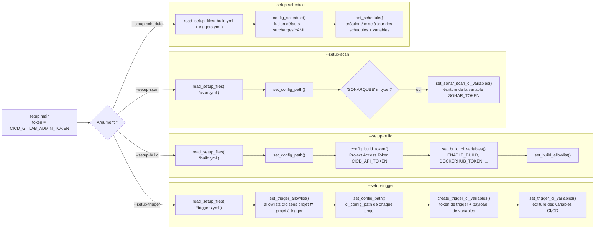

# Setup-project module

Configure automatiquement les projets GitLab (chemin du fichier de CI, variables CI/CD, tokens, allowlists de job token, schedules de pipeline) pour qu'ils puissent utiliser les modules **build-docker**, **trigger** et **scan**, sans manipulation manuelle dans l'interface GitLab.

Le module ne s'exécute que depuis le projet `cicd-configuration` : ce sont les fichiers de setup commités dans ce projet qui décrivent quels projets configurer et comment.

## Projets concernés

| Projet | Rôle dans la feature |
|--------|----------------------|
| `cicd-yaml` | Définition des jobs (`features/setup-project.yml`), 4 jobs dans le stage `setup` |
| `cicd-script` | Logique Python (`setup/`) |
| `cicd-configuration` | Fichiers de setup (`setup/*build.yml`, `setup/*triggers.yml`, `setup/*scan.yml`, `setup/by_project/*`) et variable CI/CD `GITLAB_SETUP_MODE` qui active le module |

Pour la configuration détaillée d'un projet (contenu des fichiers `build.yml` / `triggers.yml` / `scan.yml`, arguments possibles, exemples) :

- Build : voir [docs/setup/BUILD_SETUP.md](../setup/BUILD_SETUP.md)
- Trigger : voir [docs/setup/TRIGGER_SETUP.md](../setup/TRIGGER_SETUP.md)
- Scan : voir [docs/setup/SCAN_SETUP.md](../setup/SCAN_SETUP.md)

Cette page décrit uniquement **comment le module fonctionne** une fois ces fichiers écrits.

## Déclenchement

Le module est composé de 4 jobs, tous dans le stage `setup`, tous dépendants de `get-files-from-git` (pour disposer de `changes.txt`, la liste des fichiers modifiés du commit) et tous exécutés dans l'image `python-process`.

| Job | Argument passé à `setup.main` | Se lance quand… |
|-----|-------------------------------|-----------------|
| `setup-trigger-project` | `--setup-trigger` | un fichier `setup/**/*triggers.yml` est modifié |
| `setup-build-project` | `--setup-build` | un fichier `setup/**/*build.yml` est modifié |
| `setup-scan-project` | `--setup-scan` | un fichier `setup/**/*scan.yml` est modifié |
| `setup-schedule-project` | `--setup-schedule` | un fichier `setup/**/*.yml` est modifié |

Condition commune à tous les jobs : la variable `GITLAB_SETUP_MODE` ne doit pas être nulle (`if: $GITLAB_SETUP_MODE == null → when: never`). Cette variable est définie dans les paramètres CI/CD du projet `cicd-configuration` ; c'est elle qui distingue une pipeline de configuration d'une pipeline projet classique.

Les quatre arguments (`--setup-trigger`, `--setup-build`, `--setup-scan`, `--setup-schedule`) sont **mutuellement exclusifs** (`argparse` groupe requis) : chaque job lance donc exactement une des quatre branches de `main()`.

```
cd ${CICD_SCRIPT_FOLDER}
python3 -m setup.main --setup-trigger   # ou --setup-build, --setup-scan, ou --setup-schedule
```

## Fonctionnement du script

`setup/main.py` récupère le token GitLab (variable `CICD_GITLAB_ADMIN_TOKEN` par défaut, nom configurable via `SETUP_GITLAB_TOKEN_NAME`) puis aiguille selon l'argument reçu.

Toutes les branches commencent par `read_setup_files()` (`setup_general.py`), qui parcourt le dossier `setup/` du projet `cicd-configuration`, charge tous les fichiers YAML dont le nom se termine par le suffixe attendu (`triggers.yml` ou `build.yml`) et **concatène** leur contenu en une seule liste de configurations. Écrire un projet dans `setup/build.yml` ou dans `setup/by_project/mon-projet.build.yml` est donc équivalent.



### Branche `--setup-trigger`

Pour chaque entrée de `*triggers.yml` (un projet/pipeline à trigger et sa liste de `projects` déclencheurs) :

1. `set_trigger_allowlist()` — si le projet à trigger est de type `gitlab`, ajoute chaque projet déclencheur (et ses `dependencies`) dans l'allowlist de job token du projet à trigger, **et** ajoute le projet à trigger dans l'allowlist de groupe du projet déclencheur. Les deux projets peuvent ainsi s'appeler mutuellement via `CI_JOB_TOKEN`.
2. `set_config_path()` — positionne le champ `ci_config_path` de chaque projet déclencheur sur `SETUP_GITLAB_CI_CONFIG_PATH` (par défaut `.gitlab-ci.yml@…/cicd-yaml`), sauf si `change_ci: False` est présent dans la config du projet.
3. `create_trigger_ci_variables()` — pour chaque projet à trigger de type `gitlab`, récupère ou crée un **trigger token** (celui appartenant au compte `SETUP_GITLAB_ACCOUNT_USERNAME` est réutilisé s'il existe). Construit ensuite, par projet déclencheur, un dictionnaire de configuration : arguments de trigger (`trigger_files`, `branchs_only_trigger`, `branchs_mapping`, `focus_trigger`, `additional_params`, `token_name` — filtrés selon `SETUP_TRIGGER_ARGUMENTS`), le `type`, l'`id` cible, le nom de la variable de token (`TRIGGER_TOKEN_<id>` pour gitlab, `JENKINS_TRIGGER_TOKEN` ou `token_name` pour jenkins) et la valeur du token. Les configurations sont regroupées par `id` de projet déclencheur.
4. `set_trigger_ci_variables()` — écrit dans chaque projet déclencheur :
   - la (ou les) variable(s) de token de trigger (`masked: True`) ;
   - la variable `TRIGGER_CONFIGURATION` (nom configurable via `SETUP_VARIABLE_CONFIGURATION_KEY`), un JSON regroupant toute la configuration de trigger consommée ensuite par le module trigger ;
   - la variable `CICD_CONFIGURATION_PATH`.
   - Lors de la **première** configuration d'un couple (projet → projet à trigger), un message est envoyé sur `SETUP_CHANNEL_URL`.

### Branche `--setup-build`

Pour chaque entrée de `*build.yml` :

1. `set_config_path()` — même logique que pour le trigger.
2. `get_build_project_variables()` — récupère les variables CI/CD existantes du projet.
3. `config_build_token()` — gère un **Project Access Token** nommé `CICD_API_TOKEN` (scopes `api,read_api,read_repository,write_repository,read_registry,write_registry`, `access_level` 40, expiration 1 an) :
   - s'il n'existe pas → création du token et de la variable CI/CD associée (`masked: True`) ;
   - s'il existe mais que la variable a disparu → rotation du token et recréation de la variable ;
   - s'il existe et que la variable est présente → rien.
4. `set_build_ci_variables()` — écrit dans le projet :
   - `ENABLE_BUILD = yes` (nom configurable, c'est cette variable qui autorise le module build-docker à s'exécuter) ;
   - `CICD_CONFIGURATION_PATH` ;
   - `DOCKERHUB_TOKEN` et `DEPLOY_TOKEN` (`masked: True`), reprises des variables d'environnement du job de setup.
   - Message sur `SETUP_CHANNEL_URL` à la première activation.
5. `set_build_allowlist()` — ajoute dans l'allowlist du projet les instances de `SETUP_BUILD_MANDATORY_ALLOWLIST` (obligatoires pour tout projet build) puis chaque instance de `instance_to_allow`. Pour une instance de type `group`, l'autorisation est rendue bidirectionnelle (chaque projet du groupe autorise aussi le projet configuré).

### Branche `--setup-scan`

Pour chaque entrée de `*scan.yml` :

1. `set_config_path()` — même logique que pour le build et le trigger.
2. Si le champ `type` de l'entrée contient `"SONARQUBE"` (liste ou chaîne, testé par simple `in`), `set_sonar_scan_ci_variables()` récupère les variables CI/CD existantes du projet puis écrit la variable `SONAR_TOKEN` (nom configurable via `SETUP_SONAR_TOKEN_VARIABLE_NAME`). La valeur écrite est celle de la variable d'environnement de même nom lue sur le job de setup lui-même (`SETUP_SONAR_TOKEN`) : il faut donc que le projet `cicd-configuration` dispose déjà de cette variable (typiquement héritée d'un groupe/instance) pour pouvoir la propager aux projets scannés. Un message est envoyé sur `SETUP_CHANNEL_URL` lors de la première configuration du projet.

Toute autre valeur de `type` est ignorée : aucun traitement n'est déclenché.

### Branche `--setup-schedule`

Lit **à la fois** `build.yml` et `triggers.yml`. Pour chaque projet :

1. `config_schedule()` — part des schedules par défaut (`SETUP_SCHEDULE_TYPE`, plus `SETUP_BUILD_SCHEDULE_TYPE` pour les projets build) et applique les surcharges du bloc `schedule:` du YAML (cron, branche, variables…). Les schedules listés dans `SETUP_SCHEDULE_MANDATORY` (par défaut `cleanlog`) sont toujours ajoutés. La branche par défaut est la branche par défaut du projet si aucune n'est précisée ; la description est préfixée par `[<branche>]`.
2. `set_schedule()` — pour chaque schedule calculé :
   - récupère les schedules existants du projet ; si un schedule porte la même description il est **mis à jour**, sinon il est **créé** ;
   - si un schedule appartient à un autre utilisateur que `SETUP_GITLAB_ACCOUNT_USERNAME`, le compte de setup en **prend la propriété** (`take_ownership`) ;
   - crée / met à jour les variables du schedule.

### Fonctions communes (`setup/setup_general.py`)

| Fonction | Rôle |
|----------|------|
| `read_setup_files()` | Agrège tous les fichiers YAML de setup d'un type donné |
| `set_config_path()` | Positionne `ci_config_path` d'un projet (respecte `change_ci: False`) |
| `set_project_allowlist()` | Active et alimente l'allowlist de job token d'un projet (projet ou groupe + `dependencies`) |
| `config_schedule()` | Fusionne schedules par défaut et surcharges YAML |
| `set_schedule()` | Crée / met à jour un schedule GitLab, ses variables et sa propriété |

## Variables globales du script

| Variable | Défaut | Rôle |
|----------|--------|------|
| `SETUP_LOG_LEVEL` | `INFO` | Niveau de log du script |
| `SETUP_GITLAB_TOKEN_NAME` | `CICD_GITLAB_ADMIN_TOKEN` | Nom de la variable contenant le token admin GitLab utilisé pour toute la configuration |
| `SETUP_GITLAB_CI_CONFIG_PATH` | `.gitlab-ci.yml@…/cicd-yaml` | Valeur écrite dans `ci_config_path` des projets configurés |
| `SETUP_GITLAB_ACCOUNT_USERNAME` | `admin.gitlab` | Compte propriétaire attendu des tokens de trigger et des schedules |
| `SETUP_CICD_CONFIGURATION_PATH_VARIABLE_NAME` | `CICD_CONFIGURATION_PATH` | Nom de la variable de chemin vers `cicd-configuration` propagée aux projets |
| `SETUP_CHANNEL_URL` | `""` | Webhook de notification (message à la première activation d'un projet) |
| `SETUP_SCHEDULE_TYPE` | JSON (`cleanlog`) | Schedules par défaut communs à tous les projets |
| `SETUP_SCHEDULE_MANDATORY` | `["cleanlog"]` | Schedules toujours créés, quelle que soit la config projet |
| `SETUP_DEFAULT_SCHEDULE` | JSON vide | Gabarit utilisé pour un `type` de schedule inconnu |
| `SETUP_TRIGGER_FILE_ENDSWITH` | `triggers.yml` | Suffixe identifiant un fichier de setup trigger |
| `SETUP_TRIGGER_DESCRIPTION` | `Trigger cree par L'administrateur` | Description des trigger tokens créés |
| `SETUP_TRIGGER_GITLAB_VARIABLE_TRIGGER_KEY` | `TRIGGER_TOKEN` | Préfixe des variables de trigger token (`TRIGGER_TOKEN_<id>`) |
| `SETUP_TRIGGER_JENKINS_TRIGGER_TOKEN_NAME` | `JENKINS_TRIGGER_TOKEN` | Nom par défaut de la variable de token pour un trigger Jenkins |
| `SETUP_TRIGGER_ARGUMENTS` | `{"all": "trigger_files,branchs_only_trigger,branchs_mapping", "gitlab": "focus_trigger", "jenkins": "additional_params,token_name"}` | Arguments YAML repris dans `TRIGGER_CONFIGURATION` selon le type |
| `SETUP_VARIABLE_CONFIGURATION_KEY` | `TRIGGER_CONFIGURATION` | Nom de la variable JSON de configuration de trigger écrite sur les projets |
| `SETUP_BUILD_FILE_ENDSWITH` | `build.yml` | Suffixe identifiant un fichier de setup build |
| `SETUP_BUILD_TOKEN_NAME` | `CICD_API_TOKEN` | Nom du Project Access Token et de la variable créés pour le build |
| `SETUP_BUILD_TOKEN_SCOPE` | `api,read_api,read_repository,write_repository,read_registry,write_registry` | Scopes du Project Access Token de build |
| `SETUP_BUILD_TOKEN_ACCESS_LEVEL` | `40` | Niveau d'accès du Project Access Token de build |
| `SETUP_BUILD_ENABLE_BUILD_VARIABLE_NAME` | `ENABLE_BUILD` | Variable positionnée à `yes` pour autoriser le module build-docker |
| `SETUP_BUILD_DOCKERHUB_TOKEN_VARIABLE_NAME` | `DOCKERHUB_TOKEN` | Variable de token DockerHub propagée aux projets build |
| `SETUP_BUILD_DEPLOY_TOKEN_VARIABLE_NAME` | `DEPLOY_TOKEN` | Variable de token de déploiement propagée aux projets build |
| `SETUP_BUILD_SCHEDULE_TYPE` | JSON (`buildall`, `cleanghostimage`, `cleandevimage`) | Schedules par défaut supplémentaires pour les projets build |
| `SETUP_BUILD_MANDATORY_ALLOWLIST` | `{}` | Instances à ajouter d'office dans l'allowlist de tout projet build (format `{"nom": id}`) |
| `SETUP_SCAN_FOLDER_PATH` | `setup/` | Dossier parcouru pour trouver les fichiers de setup scan |
| `SETUP_SCAN_FILE_ENDSWITH` | `scan.yml` | Suffixe identifiant un fichier de setup scan |
| `SETUP_SONAR_TOKEN_VARIABLE_NAME` | `SONAR_TOKEN` | Nom de la variable CI/CD écrite sur les projets scannés, et nom de la variable d'environnement lue sur le job de setup pour en récupérer la valeur |

Tous ces paramètres sont surchargeables via la configuration `cicd-configuration/configuration/.default-conf.yml` (voir les valeurs réelles utilisées en production dans ce fichier).

## Prérequis

- Le projet `cicd-configuration` doit avoir la variable `GITLAB_SETUP_MODE` définie (non nulle) et les variables `CICD_GITLAB_ADMIN_TOKEN`, `CICD_CONFIGURATION_PATH`, `DOCKERHUB_TOKEN`. Pour le scan, la variable `SONAR_TOKEN` (ou le nom défini par `SETUP_SONAR_TOKEN_VARIABLE_NAME`) doit aussi être présente, sans quoi une chaîne vide est propagée aux projets scannés.
- Son option *CI/CD configuration file* doit pointer vers `.gitlab-ci.yml@…/cicd-yaml`.
- Le token `CICD_GITLAB_ADMIN_TOKEN` doit avoir des droits administrateur (modification de `ci_config_path`, création de tokens, gestion des allowlists et schedules sur les projets cibles).
- Voir [docs/INIT.md](../INIT.md) pour l'initialisation complète.

## Résultat

Après un commit modifiant les fichiers de `setup/` :

- **trigger** : chaque projet déclencheur reçoit son trigger token, sa variable `TRIGGER_CONFIGURATION` et son `ci_config_path`, et les allowlists croisées sont en place → le module trigger devient opérationnel.
- **build** : chaque projet reçoit `CICD_API_TOKEN`, `ENABLE_BUILD = yes`, les tokens DockerHub/déploiement, son `ci_config_path` et ses allowlists → le module build-docker devient opérationnel.
- **scan** : chaque projet listé avec `type: ["SONARQUBE"]` reçoit la variable `SONAR_TOKEN` et son `ci_config_path`. Il reste ensuite à définir `SONAR_HOST_URL`, `sonar-project.properties` et `LAUNCH_FEATURE` sur le projet cible (voir [docs/setup/SCAN_SETUP.md](../setup/SCAN_SETUP.md)) pour que le module scan devienne opérationnel.
- **schedule** : les schedules de pipeline (nettoyage de logs, rebuild quotidien, nettoyage du registry…) sont créés ou mis à jour sur les projets, avec prise de propriété par le compte de setup.

---
