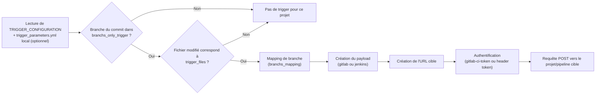

# Trigger module

Déclenche un ou plusieurs pipelines d'autres projets (GitLab) ou pipelines (Jenkins) suite à un push/merge dans le projet courant, avec filtrage par branche, par fichiers modifiés et mapping de branches.

## Projets concernés

| Projet | Rôle dans la feature |
|------|----------------------|
| `cicd-yaml` | Définition du job (`features/trigger-project.yml`) |
| `cicd-script` | Logique Python (`trigger/`) |
| `cicd-configuration` | Configuration des projets à trigger (`setup/triggers.yml`) et variable `TRIGGER_CONFIGURATION` |

Pour la configuration détaillée d'un projet (fichiers `triggers.yml`, `trigger_parameters.yml`), voir [docs/setup/TRIGGER_SETUP.md](../setup/TRIGGER_SETUP.md).

## Fonctionnement du script

1. Le job `trigger` (stage `trigger`) lit la variable `TRIGGER_CONFIGURATION` (JSON défini dans `cicd-configuration`, généré à partir de `setup/triggers.yml`) ainsi qu'un éventuel fichier `trigger_parameters.yml` à la racine du projet courant, qui vient surcharger la configuration (`add_local_file_to_config`).
2. Pour chaque projet à trigger défini dans la configuration, `trigger/main.py` boucle et appelle `trigger()` (`trigger_function.py`).
3. `check_if_branch_can_trigger` vérifie que la branche du commit fait partie de `branchs_only_trigger` (si le paramètre est absent, toutes les branches sont autorisées).
4. `check_if_file_can_trigger` vérifie que les fichiers modifiés du commit (lus depuis `changes.txt`, généré par le job `get-files-from-git`) correspondent à un des motifs de `trigger_files` (si le paramètre est absent, tous les fichiers sont autorisés).
5. `get_mapped_branch` transforme, si besoin, la branche source en branche cible grâce à `branchs_mapping` (ex : `main` → `prod`).
6. `create_payload` construit le corps de la requête, différent selon le `type` :
   - **gitlab** : `token`, `ref` (branche mappée), `variables[CI_PROJECT_TRIGGER]`, `variables[CI_BRANCH_TRIGGER]`, `variables[TRIGGER_DESCRIPTION]`, `variables[TRIGGER_VARIABLES]` (calculées à partir des tags trouvés dans le message de commit, ex : `--parent-recette`), et `variables[CI_CHANGES_TRIGGER]` si `focus_trigger` est activé.
   - **jenkins** : `pipeline_name` et `additional_params` (JSON optionnel).
7. `create_url` construit l'URL cible : pour `gitlab`, l'API `trigger/pipeline` du projet (avec son `id`) ; pour les autres types, elle est déterminée grâce au mapping `TRIGGER_URL_MAPPING` (une URL par branche mappée, avec `TRIGGER_DEFAULT_BRANCH` en secours).
8. `create_request_auth` prépare l'authentification : `gitlab-ci-token` + `${CI_JOB_TOKEN}` pour gitlab, header `token` (variable désignée par `token_name`) pour jenkins.
9. La requête POST est envoyée. Côté projet cible, si celui-ci utilise aussi `cicd-yaml`, le `workflow` du `.gitlab-ci.yml` reconnaît `$CI_PIPELINE_SOURCE == "trigger"` et réinjecte les variables reçues (`CI_PROJECT_TRIGGER_CICD`, `CI_BRANCH_TRIGGER_CICD`, `CI_CHANGES_TRIGGER_CICD`, `CI_COMMIT_MESSAGE`, ...).

## Prérequis

- La variable `TRIGGER_CONFIGURATION` doit être définie (sinon le job est `when: never`).
- Le projet doit être déclaré dans `cicd-configuration/setup/triggers.yml` (ou `setup/by_project/<projet>.triggers.yml`) — voir [docs/setup/TRIGGER_SETUP.md](../setup/TRIGGER_SETUP.md).
- Le job dépend de `get-files-from-git` pour disposer du fichier `changes.txt` (fichiers modifiés du commit).

## Déclenchement

Le job `trigger` (stage `trigger`) se lance automatiquement à chaque pipeline dès que `LAUNCH_FEATURE` contient `trigger-project` (valeur incluse par défaut), sauf si le message de commit contient `ci-clean-` (nettoyage prioritaire).

## Variables globales du script

| Variable | Défaut | Rôle |
|----------|--------|------|
| `TRIGGER_LOG_LEVEL` | `INFO` | Niveau de log du script |
| `TRIGGER_URL_MAPPING` | `{}` | JSON `{type: {branche: url}}` utilisé pour construire l'URL des projets non-gitlab (ex : jenkins) |
| `TRIGGER_DEFAULT_BRANCH` | `prod` | Branche de secours utilisée dans `TRIGGER_URL_MAPPING` si la branche mappée n'existe pas |
| `TRIGGER_PARAMETERS_FILE_NAME` | `./trigger_parameters.yml` | Chemin du fichier local de surcharge de configuration |
| `TRIGGER_DESCRIPTION_VARIABLES` | `[{"tag": "--parent-recette","name":"CI_PARENT_RECETTE"}]` | Liste de tags à détecter dans le message de commit pour générer `variables[TRIGGER_VARIABLES]` du payload gitlab |

## Résultat

Un nouveau pipeline est déclenché sur chaque projet/pipeline cible qui remplit les conditions de branche et de fichiers modifiés, avec les informations du projet déclencheur transmises en variables.

---
